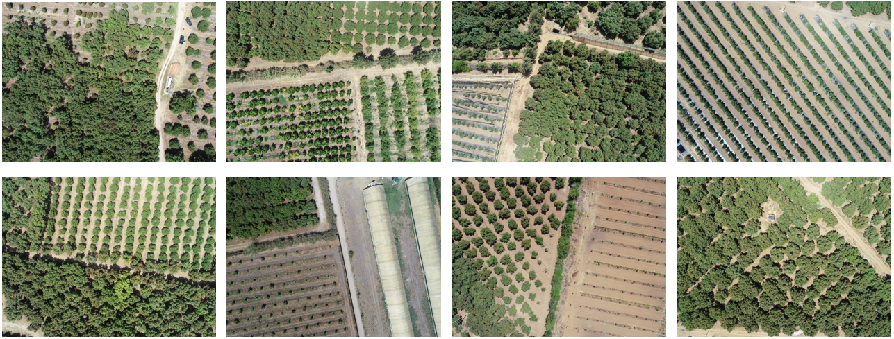
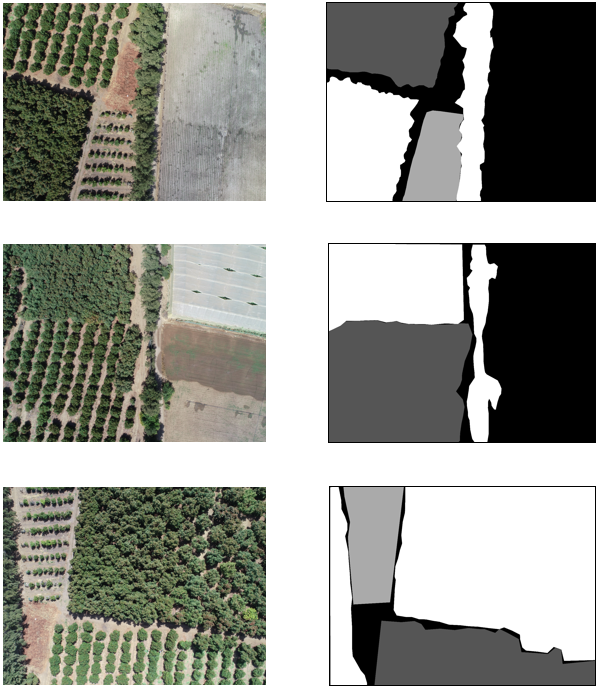
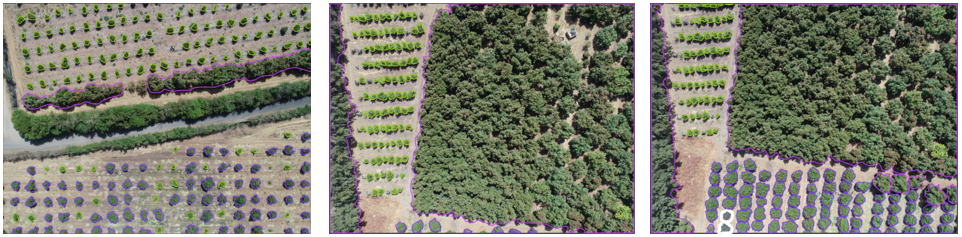

# Dataset Description
AVO-AIR dataset (~7,04Gb) consists of 986 high resolution aerial images, capturing a wide area of an avocado field located in ALLAL TTAZI region of MOROCCO, gps coordonate 34°34'55.4"N 6°21'60.0"W , as well as two type of annotations of 89 images used to train two models for trees size classification, in a .tiff file for the first model and .json file for the second model. The annotation process of the trees instances was done by the members of our laboratory, using online annotation tools.

[makesense.ai](https://www.makesense.ai/) provides .json file in VGG styles:

- Small trees with label 'small'
- Medium trees with label 'medium'
- Large trees with label 'large'

[apeer.com](https://www.apeer.com/) provides .tiff file with labels:

- '0' background
- '1' for medium trees
- '2' for small trees
- '3' for large trees

# Download
AVO-AIR dataset can be downloaded [here](https://www.genome.gov/).
# Data Acquisition
# Visualizations

### images from the data :

### Annotation 1 :

### Annotation 2:

# Files Description

      - 'Database Avo-AirDB' folder: contains the 4864x3648 RGB  aerial images. Total images are 986, 
      56 are annotated in .tiff format ,'annotation1' folder,  and 89 are annotated in .json ,'annotation2' folder.

      - 'annotation1' folder: contains two folders 'images' and 'masks'
            - 'images' folder: contain 56 RGB images
            - 'masks' folder : contain the coresponding masks in .tiff format
    
      - 'annotation2' folder : contains two folders 'images' and 'labels'

            - 'images' folder: contain 89 RGB images
    
            - 'labels' folder: contain lables in .json file 'vgg_label.json'
   
Image filenames are defined with an ID number, such as:
 
 DJI_0002.JPG
 
# Citing the dataset

If you use this dataset, please cite the following publication:

_K. El Amraoui, M. Lghoul, A. Ezzaki, L.Masmoudi, M.hadri, H.Elbelrhiti and A.Abaz, (2022). Avo-AirDB: An avocado UAV Database for agricultural image segmentation and classification._ 

            @article{elamraoui2022Avo,
            title={Avo-AirDB: An avocado UAV Database for agricultural image segmentation and classification.},
            author={Khalid El Amraoui, Moaataz Lghoul , Ayoub Ezzaki , Lhoussaine Masmoud , Majid hadri , Hicham Elbelrhiti and Aziz Abaz c },
            journal={},
            volume={},
            pages={},
            year={2022},
            issn = {},
            doi = {},
            publisher={Elsevier}
            }
            
# Acknowledgment

This research has been financed by the Ministry of Higher Education and Scientific Research of Morocco (MESRSFC), the National Centre of Scientific and Technical Research of Morocco (CNRST) and Digital Development Agency of Morocco (ADD).
